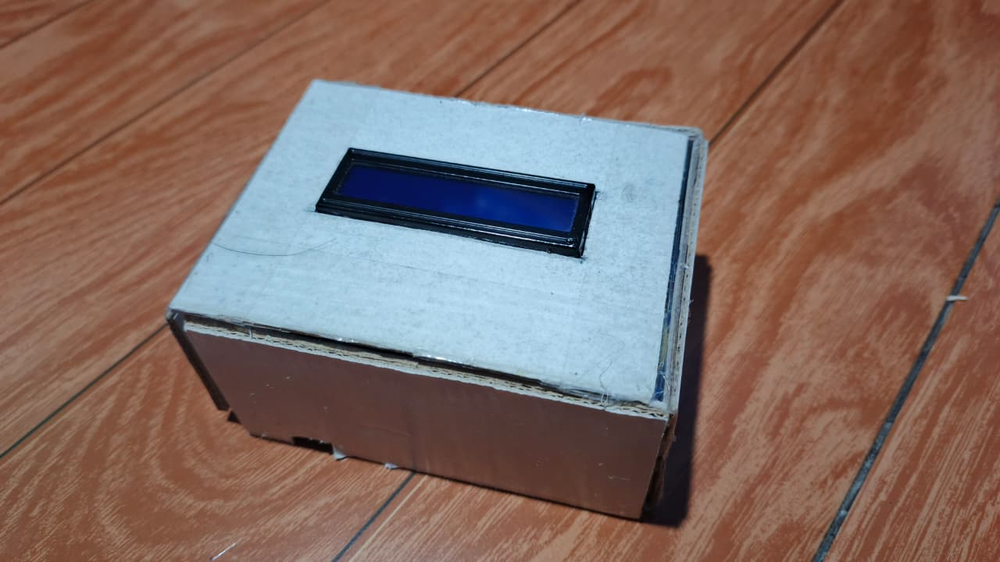
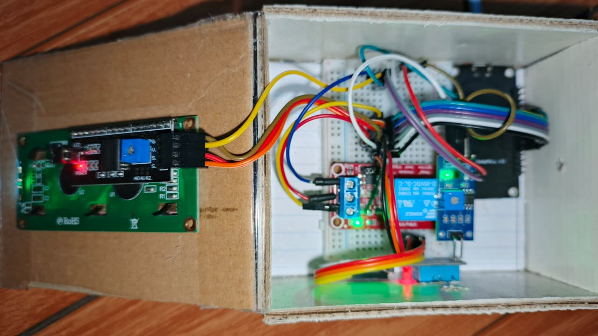
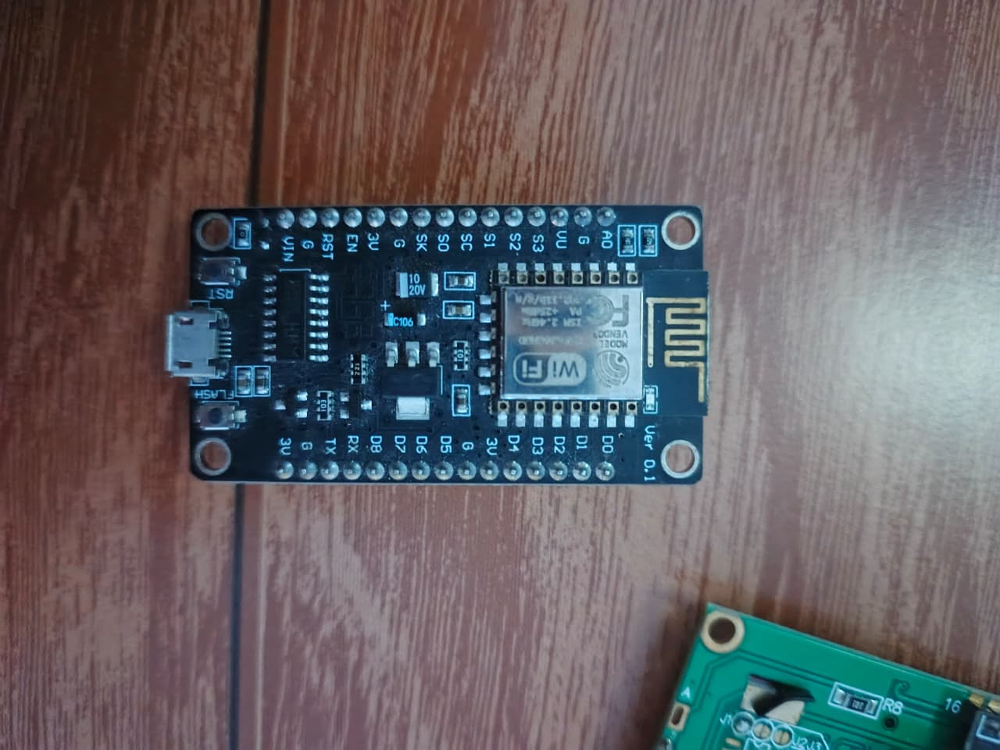
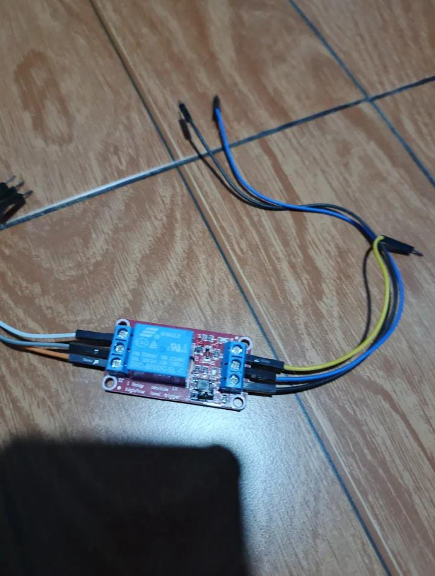
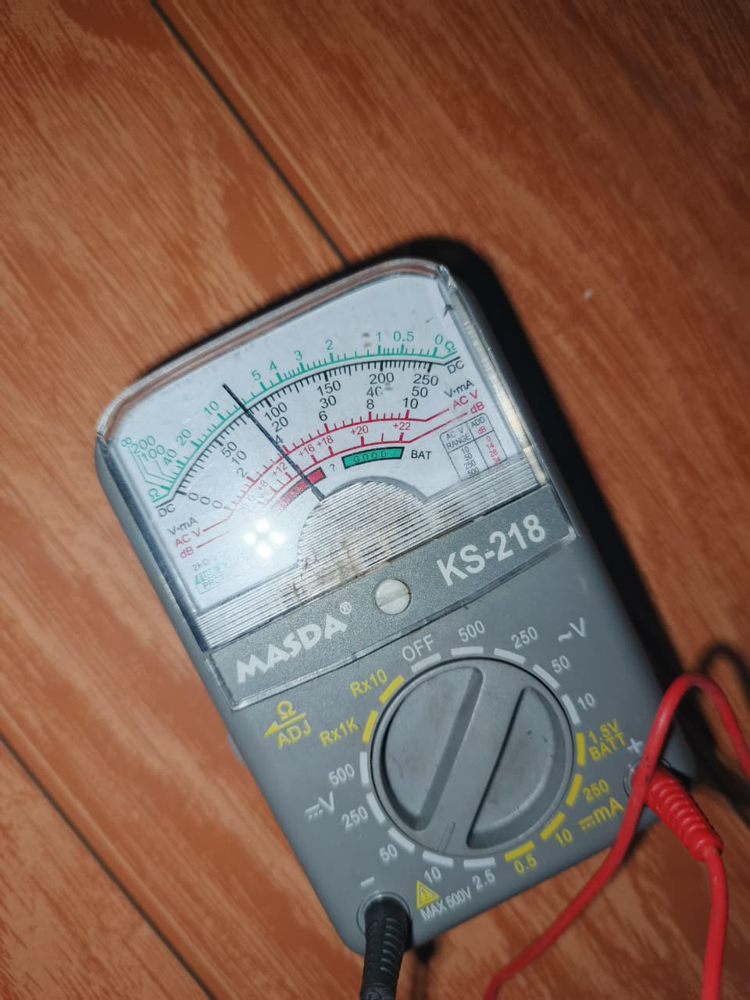

# 🌿 Smart Plant Monitor

> Sistem monitoring tanaman berbasis IoT menggunakan NodeMCU v3 Lolin. Menampilkan data lingkungan secara real-time dan memberikan rekomendasi waktu siram — baik otomatis berdasarkan sensor kelembaban tanah, maupun berdasarkan jadwal yang dibuat pengguna.
>
> An IoT-based plant monitoring system using NodeMCU v3 Lolin. Displays real-time environmental data and provides watering recommendations — either automatically based on soil moisture, or based on a user-defined schedule.

---

## 📸 Demo










---

## 🇮🇩 Deskripsi

Alat ini membaca suhu, kelembaban udara, dan kelembaban tanah secara real-time, lalu menampilkannya di LCD lokal dan web dashboard yang dapat diakses dari HP. Pengguna dapat memilih dua mode rekomendasi siram:

- **Mode Sensor** — rekomendasi otomatis berdasarkan nilai kelembaban tanah vs threshold yang bisa diatur
- **Mode Jadwal** — pengguna membuat jadwal siram sendiri (hingga 5 jadwal), relay akan aktif sebagai sinyal fisik saat waktunya tiba

NodeMCU terhubung ke WiFi rumah menggunakan **WiFiManager** — tidak perlu upload ulang kode jika berpindah lokasi. Waktu sinkronisasi otomatis menggunakan **NTP** (WIB/UTC+7).

## 🇬🇧 Description

This device reads temperature, air humidity, and soil moisture in real-time, displaying them on a local LCD and a web dashboard accessible from a smartphone. Users can choose between two watering recommendation modes:

- **Sensor Mode** — automatic recommendation based on soil moisture vs an adjustable threshold
- **Schedule Mode** — users create their own watering schedules (up to 5), with the relay activating as a physical signal when the time arrives

The NodeMCU connects to home WiFi using **WiFiManager** — no need to re-upload code when changing locations. Time is automatically synced using **NTP** (WIB/UTC+7).

---

## ✨ Fitur / Features

| Fitur (ID) | Feature (EN) |
|---|---|
| Monitoring suhu & kelembaban udara real-time | Real-time temperature & air humidity monitoring |
| Monitoring kelembaban tanah | Soil moisture monitoring |
| Rekomendasi siram otomatis (mode sensor) | Automatic watering recommendation (sensor mode) |
| Jadwal siram buatan pengguna (mode jadwal) | User-defined watering schedule (schedule mode) |
| Relay aktif sebagai sinyal fisik saat jadwal tiba | Relay activates as physical signal when schedule triggers |
| Jadwal tersimpan di EEPROM (tidak hilang saat mati) | Schedules saved to EEPROM (persistent across power cycles) |
| Tampilan data lokal di LCD 16x2 (3 halaman bergantian) | Local data display on LCD 16x2 (3 rotating pages) |
| Web dashboard futuristik, akses dari HP via browser | Futuristic web dashboard, accessible from phone browser |
| WiFiManager — setup WiFi dari browser, fleksibel pindah lokasi | WiFiManager — WiFi setup via browser, flexible across locations |
| NTP sync otomatis (WIB/UTC+7) | Automatic NTP time sync (WIB/UTC+7) |
| Tombol "Ganti WiFi" di dashboard | "Change WiFi" button on dashboard |
| Auto-refresh dashboard setiap 2 detik | Dashboard auto-refresh every 2 seconds |

---

## 🔧 Hardware

| Komponen / Component | Jumlah / Qty |
|---|---|
| NodeMCU v3 Lolin (ESP8266 / CH340C) | 1 |
| DHT11 Temperature & Humidity Sensor | 1 |
| LCD 16x2 + I2C Module (alamat 0x27) | 1 |
| Relay Module 1 Channel (SRD-05VDC-SL-C) | 1 |
| Soil Moisture Sensor FC-28 (analog) | 1 |
| Breadboard | 1 |
| Kabel Jumper Male-to-Female / Jumper Wires | secukupnya |

---

## 📌 Wiring / Pin Mapping

Lihat file terpisah: **[WIRING.md](WIRING.md)**

---

## 💻 Software

### Library yang dibutuhkan / Required Libraries
Install via Arduino IDE → Tools → Manage Libraries:

| Library | Author |
|---|---|
| `LiquidCrystal I2C` | Frank de Brabander |
| `DHT sensor library` | Adafruit |
| `Adafruit Unified Sensor` | Adafruit *(auto-install saat install DHT)* |
| `WiFiManager` | tzapu |
| `NTPClient` | Fabrice Weinberg |
| `ESP8266WiFi` | ESP8266 Community *(include dalam board package)* |
| `ESP8266WebServer` | ESP8266 Community *(include dalam board package)* |

### Board Setup
1. Tambahkan URL board ESP8266 di Arduino IDE → File → Preferences:
   `http://arduino.esp8266.com/stable/package_esp8266com_index.json`
2. Install board: Tools → Boards Manager → cari **"esp8266"** → Install
3. Pilih board: **NodeMCU 1.0 (ESP-12E Module)**
4. Install driver USB: **CH340C** (diperlukan agar Windows mendeteksi port COM)

---

## 🚀 Cara Pakai / How to Use

### Pertama Kali / First Time Setup
1. Upload `smart_plant_monitor.ino` ke NodeMCU
2. NodeMCU akan membuat WiFi **"PlantSetup"**
3. Sambungkan HP ke WiFi **"PlantSetup"**
4. Halaman konfigurasi akan muncul otomatis di browser
5. Pilih WiFi rumah dari daftar, masukkan password, klik Save
6. NodeMCU restart dan terhubung ke WiFi rumah
7. Lihat IP address di Serial Monitor (baud 115200), misal: `192.168.0.9`
8. Buka browser HP, ketik IP tersebut → dashboard muncul

### Ganti WiFi / Change WiFi
- Buka dashboard → scroll ke bawah → klik **"⟳ GANTI WIFI"**
- NodeMCU akan restart ke mode setup ulang
- Sambungkan HP ke **"PlantSetup"** dan ulangi langkah setup

### Cara Baca LCD / Reading the LCD
LCD bergantian menampilkan 3 halaman setiap 3 detik:

**Halaman 1 — Suhu & Kelembaban Udara:**
```
Suhu: 29.8°C
Udara: 70%
```

**Halaman 2 — Kelembaban Tanah & Jam:**
```
Tanah: 45%
Jam: 07:00
```

**Halaman 3 — Status Rekomendasi Siram:**
```
Status:
Siram Sekarang!
```

### Mode Sensor
- Aktifkan tab **"◈ MODE SENSOR"** di dashboard
- Atur slider **THRESHOLD** sesuai kebutuhan (default 40%)
- Jika kelembaban tanah < threshold → **"SIRAM SEKARANG"**
- Jika kelembaban tanah ≥ threshold → **"JANGAN SIRAM"**

### Mode Jadwal
- Aktifkan tab **"◷ MODE JADWAL"** di dashboard
- Tambahkan jadwal siram dengan memasukkan jam dan menit
- Saat waktu jadwal tiba → status berubah **"WAKTUNYA SIRAM"** + relay aktif 5 detik sebagai sinyal fisik
- Jadwal tersimpan otomatis di EEPROM, tidak hilang meski mati listrik

---

## ⚙️ Konfigurasi / Configuration

Ubah nilai-nilai ini di bagian atas kode sesuai kebutuhan:

```cpp
// Threshold kelembaban tanah default (persen)
int thresholdTanah = 40;

// Durasi relay aktif saat jadwal siram tiba (milidetik)
const long relayDurasi = 5000; // 5 detik

// Timezone NTP (detik) — WIB = UTC+7 = 7 * 3600
NTPClient timeClient(ntpUDP, "pool.ntp.org", 7 * 3600, 60000);
```

---

## 🔬 Kalibrasi Sensor Tanah / Soil Sensor Calibration

| Kondisi | Nilai Raw | Persentase |
|---|---|---|
| Sensor di udara / sangat kering | **1024** | 0% |
| Sensor terendam air penuh | **351** | 100% |

Lihat detail kalibrasi di **[WIRING.md](WIRING.md)**

---

## 📁 Struktur File / File Structure

```
smart-plant-monitor/
├── smart_plant_monitor.ino     # Kode utama / Main code
├── README.md                   # Dokumentasi ini / This documentation
├── WIRING.md                   # Panduan wiring & kalibrasi / Wiring guide
└── test_sketches/              # Sketch testing per komponen
    ├── TestDHT11/
    │   └── TestDHT11.ino
    ├── TestLCD_D5D6/
    │   └── TestLCD_D5D6.ino
    ├── TestSoilMoisture/
    │   └── TestSoilMoisture.ino
    └── TestRelay/
        └── TestRelay.ino
```

---

## 🛠️ Troubleshooting

| Masalah / Problem | Solusi / Solution |
|---|---|
| LCD blank / tidak ada tulisan | Pastikan VCC LCD ke pin **VU** (bukan 3V3). Putar trimpot kontras pelan-pelan |
| LCD tidak terdeteksi (I2C scanner kosong) | Cek wiring: SDA→D5, SCL→D6, jangan sampai tertukar |
| DHT11 baca `nan` | Cek kabel DATA ke D4, VCC ke 3V3 |
| Relay tidak aktif saat jadwal tiba | Pastikan NTP sudah sync (butuh koneksi internet), cek jam di dashboard |
| Port COM tidak muncul di Arduino IDE | Install driver **CH340C** |
| Dashboard tidak bisa diakses | Pastikan HP dan NodeMCU terhubung ke WiFi yang sama |
| WiFi "PlantSetup" tidak muncul | NodeMCU sudah pernah tersimpan WiFi — klik "Ganti WiFi" di dashboard atau tekan RST |
| Jadwal hilang setelah mati listrik | Jadwal tersimpan di EEPROM, seharusnya tidak hilang. Coba tambah ulang jadwal |

---

## 📝 Catatan Teknis / Technical Notes

- Pin **S1/S2/S3/SC/SO/SK** di NodeMCU tidak aman digunakan sebagai GPIO — terhubung ke flash memory internal ESP8266
- Pin **VU** menghasilkan 5V langsung dari USB, digunakan untuk LCD dan Relay karena keduanya butuh 5V
- Pin **VIN** di NodeMCU v3 Lolin adalah input eksternal, bukan output 5V dari USB
- Hysteresis tidak diterapkan di mode sensor (relay tidak dipakai di mode ini)
- Relay aktif selama **5 detik** sebagai sinyal fisik, setelah itu mati otomatis

---

## 📌 Status Project

Project ini adalah **prototype final** — selesai dan tidak akan ada penambahan fitur.
Jika ada pembaruan di masa depan, akan dibangun ulang dari awal sebagai project baru.

This project is a **final prototype** — complete with no further feature additions planned.
Any future updates will be rebuilt from scratch as a new project.

---

## 👤 Author

> *(Tambahkan nama dan info kontakmu di sini / Add your name and contact info here)*

---

## 📄 License

MIT License — bebas digunakan dan dimodifikasi dengan tetap mencantumkan kredit.
MIT License — free to use and modify with proper attribution.
